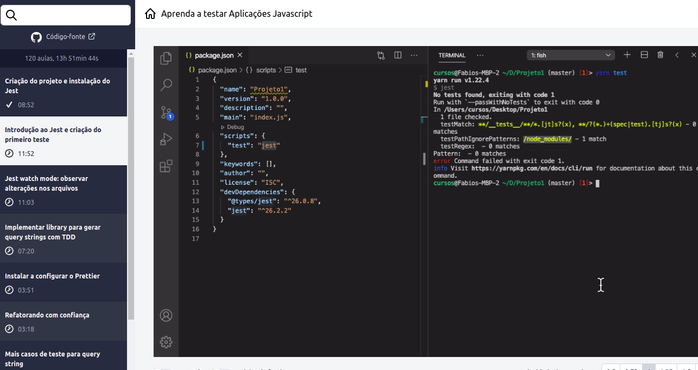

<h1 align="center">
    
</h1>

<h2 align="center">
	Testando Aplicações em Javascript
</h4>
<p align="center">
  

  <a href="https://www.linkedin.com/in/kaiorr/">
    
  </a>

  <a href="https://github.com/kaiorr/javascriptTest/commits/master">
    
  </a>

  
   <a href="https://github.com/kaiorr/javascriptTest/stargazers">
    
  </a>
</p>


## ℹ Para que serve esse Repo?

Este repositório será para registro de todo conhecimento adiquirido durante o curso do mestre Fábio Vedovelli. Para quem tiver interesse no curso, vou deixar o link que vai direto para a página do mesmo. [Aprendendo_Testes](https://www.javascript.tv.br/)


## 🚀 Conteúdo

* Módulo 1
  * Tipos de Teste
  * Como os testes garatem integridade da aplicação
  * Ferramentas
  * Bibliotecas
  * Projeto 1 - Pequena lib e uma classe

* Módulo 2
  * Projeto 2 - Vuejs/Nuxt
  * Avaliando ferramentas para Vue
  * Testar componentes de forma isolada (Unit Testing)
  * Testar componentes container (Integration Testing)
  * Testar aplicação completa (E2E Testing)

* Módulo 3
  * 🚧

* Módulo 4
  * 🚧

### 🤔 How to contribute

```bash
   #Make a fork;
   #Create a branck with your feature:
    git checkout -b my-feature
   #Commit changes:
    git commit -m 'feat: My new feature'
   #Make a push to your branch:
    git push origin my-feature

#After merging your receipt request to done, you can delete a branch from yours.
```

## 📝 Contact

Made with ♥ by Kaio Ribeiro  [Get in touch!](https://www.linkedin.com/in/kaio-ribeiro-310123150/)
